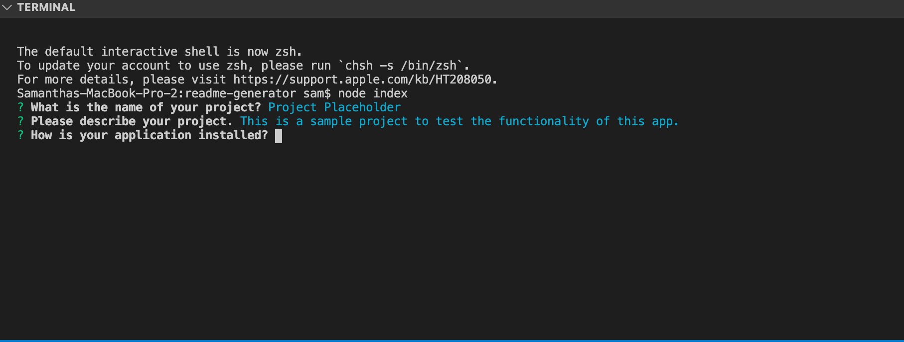

# README Generator

  ## Description
  This command line application generates a professional README file based on input from the user. 
  
  
  
  ## Table of Contents
  * [Installation](#installation)
  * [Usage](#usage)
  * [License](#license)
  * [Contributing](#contributing)
  * [Questions](#questions)
  
  ## Installation
  This application is run in Node.js.  To install, please download the files from the repository and run “npm I” from the command line to install the dependencies.  
  
  ## Usage
  Once installed, you trigger the program at your command line with the command: “node index.js”.  The application will ask you a series of questions, then create your README.md file based on your answers.
  
  
  [Link to video](https://drive.google.com/file/d/1ELOT5hMhJaubP2fo-Q_nHu1V9onZjCWF/view)
  ## License
  MIT
  
  ## Contributing
  To contribute to this package, please contact me on GitHub. (My profile information is in the [Questions](#questions) section below.
  
  ## Questions
  If you have any questions, please send them to me through GitHub or email.

  Github Username: sfunk11

  [borley1@gmail.com](mailto:borley1@gmail.com)
